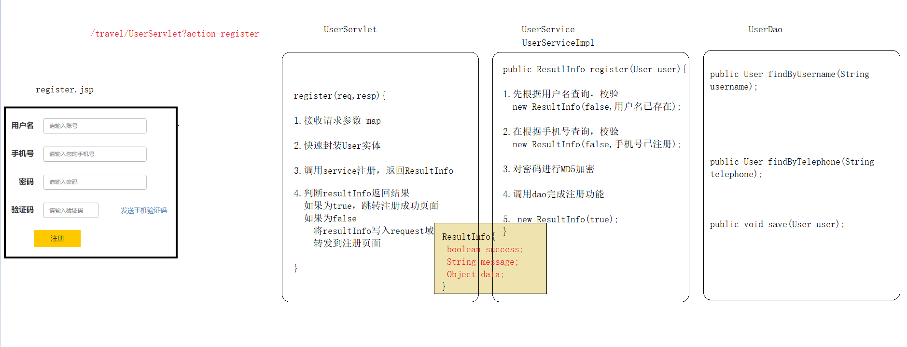

# 黑马旅游网(web阶段综合练习)
## 第一天 页面搭建及注册功能
### 1 项目搭建
#### 1.1 项目介绍
> 为了巩固web基础知识，提升综合运用能力，故而讲解此案例。要求，每位同学能够独立完成此案例。
#### 1.2 技术选型
> + 前台内容使用bootstrap框架结合jq , ajax , json等搭建而成。
> + 采用了三层架构的设计模式

#### 1.3 数据库设计
一个存在八张表,分别代表用户表,地址表,订单表,关系表,商品表,及部分细节表格
#### 1.4 创建maven项目
+ [pom.xml](pom.xml)
+ [实体包](./src/main/java/com/itheima/travel/domain)
+ [工具类](./src/main/java/com/itheima/travel/util)
+ [核心配置文件](./src/main/resources)
+ [页面素材](./src/main/webapp)
+ [过滤器包](./src/main/java/com/itheima/travel/web/filter)
+ [servlet包](./src/main/java/com/itheima/travel/web/servlet)
+ [service包](./src/main/java/com/itheima/travel/service)
+ [dao层接口包](./src/main/java/com/itheima/travel/dao)
+ [dao层xml配置包](./src/main/resources/com/itheima/travel/dao)
### 2 用户注册基本功能
#### 2.1 需求分析

#### 2.2 代码实现
> 页面部分

[注册页面](./src/main/webapp/register.jsp) | [注册成功页面](./src/main/webapp/register_ok.jsp)

> Servlet部分

```java
protected void register(request, response) throws Exception {
    // 1.接收请求参数 map
    request.getParameterMap();

    // 2.封装到User实体
    new User();   

    // 3.调用service注册
    userService.register(user);

    // 4.判断
    if (getSuccess()) { // 注册成功
        sendRedirect("/register_ok.jsp");
    } else {// 注册失败
        setAttribute("message", getMessage());
        getRequestDispatcher("register.jsp")
    }
}
```

[UserServlet](./src/main/java/com/itheima/travel/web/servlet/UserServlet.java)

> UserService(接口+实现)

```java
ResultInfo register(User user);
```

[接口](./src/main/java/com/itheima/travel/service/UserService.java) | [实现类](./src/main/java/com/itheima/travel/service/impl/UserServiceImpl.java)

> UserDao

```java
/**
* 根据用户名查询     
*/
User findByUsername(String username);

/**
* 根据手机号进行查询
*/
User findByTelephone(String telephone);

/**
* 注册
*/
void save(User user);
```

[接口](./src/main/java/com/itheima/travel/dao/UserDao.java) | [映射文件](./src/main/resources/com/itheima/travel/dao/UserDao.xml)

## 第二天 注册页文本校验短信验证码等
### 校验用户名