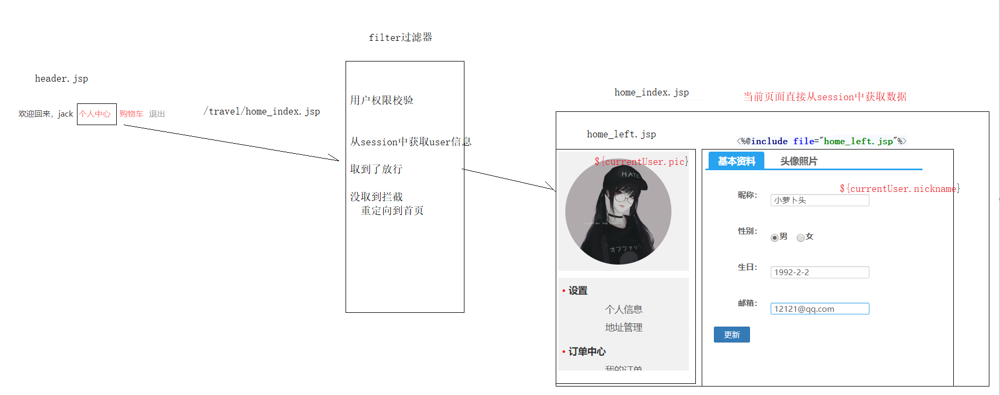

# 黑马旅游网(web阶段综合练习)
## 第一天 页面搭建及注册功能
### 1 项目搭建
#### 1.1 项目介绍
> 为了巩固web基础知识，提升综合运用能力，故而讲解此案例。要求，每位同学能够独立完成此案例。
#### 1.2 技术选型
> + 前台内容使用bootstrap框架结合jq , ajax , json等搭建而成。
> + 采用了三层架构的设计模式

#### 1.3 数据库设计
一个存在八张表,分别代表用户表,地址表,订单表,关系表,商品表,及部分细节表格
#### 1.4 创建maven项目
+ [pom.xml](pom.xml)
+ [实体包](./src/main/java/com/itheima/travel/domain)
+ [工具类](./src/main/java/com/itheima/travel/util)
+ [核心配置文件](./src/main/resources)
+ [页面素材](./src/main/webapp)
+ [过滤器包](./src/main/java/com/itheima/travel/web/filter)
+ [servlet包](./src/main/java/com/itheima/travel/web/servlet)
+ [service包](./src/main/java/com/itheima/travel/service)
+ [dao层接口包](./src/main/java/com/itheima/travel/dao)
+ [dao层xml配置包](./src/main/resources/com/itheima/travel/dao)
### 2 用户注册基本功能
#### 2.1 需求分析

#### 2.2 代码实现
> 页面部分

[注册页面](./src/main/webapp/register.jsp) | [注册成功页面](./src/main/webapp/register_ok.jsp)

> Servlet部分

```java
protected void register(request, response) throws Exception {
    // 1.接收请求参数 map
    request.getParameterMap();

    // 2.封装到User实体
    new User();   

    // 3.调用service注册
    userService.register(user);

    // 4.判断
    if (getSuccess()) { // 注册成功
        sendRedirect("/register_ok.jsp");
    } else {// 注册失败
        setAttribute("message", getMessage());
        getRequestDispatcher("register.jsp")
    }
}
```

[UserServlet](./src/main/java/com/itheima/travel/web/servlet/UserServlet.java)

> UserService(接口+实现)

```java
ResultInfo register(User user);
```

[接口](./src/main/java/com/itheima/travel/service/UserService.java) | [实现类](./src/main/java/com/itheima/travel/service/impl/UserServiceImpl.java)

> UserDao

```java
/**
* 根据用户名查询     
*/
User findByUsername(String username);

/**
* 根据手机号进行查询
*/
User findByTelephone(String telephone);

/**
* 注册
*/
void save(User user);
```

[接口](./src/main/java/com/itheima/travel/dao/UserDao.java) | [映射文件](./src/main/resources/com/itheima/travel/dao/UserDao.xml)

## 第二天 注册页文本校验短信验证码等
### 校验用户名
> 通过ajax技术实现对用户名的校验。通过对此功能的简单修改,实现了输入用户名后,焦点离开文本框后立即给出结果判断此用户名是否已被注册过.

> 页面部分

```js
// 绑定事件
$("#username").blur(function() {
// 获取属性值
let username = this.value;
// 通过ajax发送请求使用get函数
let url = '${pageContext.request.contextPath}/UserServlet';
let data = 'action=ajaxCheackUsername&username='+username;
$.get(url,data,function (resp) {
        // 处理结果
        //alert(resp.message)
        if (resp.success){
            $("#userInfo").css("color","green").html(resp.message);
        }else {    
            $("#userInfo").css("color","red").html(resp.message);    
        }
    });
});
```

[注册页面](./src/main/webapp/register.jsp)

> servlet部分 

```java
protected void ajaxCheackUsername(HttpServletRequest request, HttpServletResponse response) throws ServletException, IOException {
    // 接收请求参数
    String username = request.getParameter("username");
    // 调用service查询
    User user = userService.findByUsername(username);

    // 判断结果
    ResultInfo resultInfo = null;
    // 已存在的情况
    if (user!=null){

        resultInfo = new ResultInfo(false,"用户名已存在");
    }else {
        // 不存在的情况
        resultInfo = new ResultInfo(true,"√");

    }
    // 将结果转为json new ObjectMapper.writeValueAsString
    ObjectMapper objectMapper = new ObjectMapper();
    String s = objectMapper.writeValueAsString(resultInfo);


    // 响应到客户端
    // 声明格式
    response.setContentType("application/json;charset=utf-8");
    response.getWriter().write(s);
}
```

[UserServlet](./src/main/java/com/itheima/travel/web/servlet/UserServlet.java)

> service部分

```java
@Override
public User findByUsername(String username) {
    SqlSession sqlSession = MyBatisUtils.openSession();
    UserDao mapper = sqlSession.getMapper(UserDao.class);
    User byUsername = mapper.findByUsername(username);
    MyBatisUtils.release(sqlSession);
    return byUsername;
}
```

[接口](./src/main/java/com/itheima/travel/service/UserService.java) | [实现类](./src/main/java/com/itheima/travel/service/impl/UserServiceImpl.java)

### 阿里云短信服务调用
#### 1.申请账号,选择服务
> 申请签名是最难的一部分,如果申请不到请耐心反复申请,请坚持下来,一定不要放弃希望,相信奇迹一定会出现的.

#### 2.引入sdk
> 导入默认的工具文件
> 填入自己申请到的accessKey,就可以调用了

+ 验证码是自己生成的随机数
+ 手机号前台获取
+ 验证码保存到session
```java
    // 签名
    String signName = "MRYHL技术栈";
    // 模版
     String templateCode = "##########";
    
    // json模板参数
    String param = "{\"code\":\"" + code + "\"}";
    try {
        SendSmsResponse sendSmsResponse = SmsUtils.sendSms(telephone, signName, templateCode, param);
        if (sendSmsResponse.getCode().equalsIgnoreCase("ok")){
            System.out.println(code);
            return new ResultInfo(true,"发送成功");
        }
    } catch (ClientException e) {
        e.printStackTrace();
    }
    return  new ResultInfo(false,"服务器忙...");
```

## 第三天 登陆与地址管理
### 1.登陆模块
#### 1.1 账号密码登陆


#### 1.2 验证码登陆


### 2.个人信息修改


### 3.地址管理


